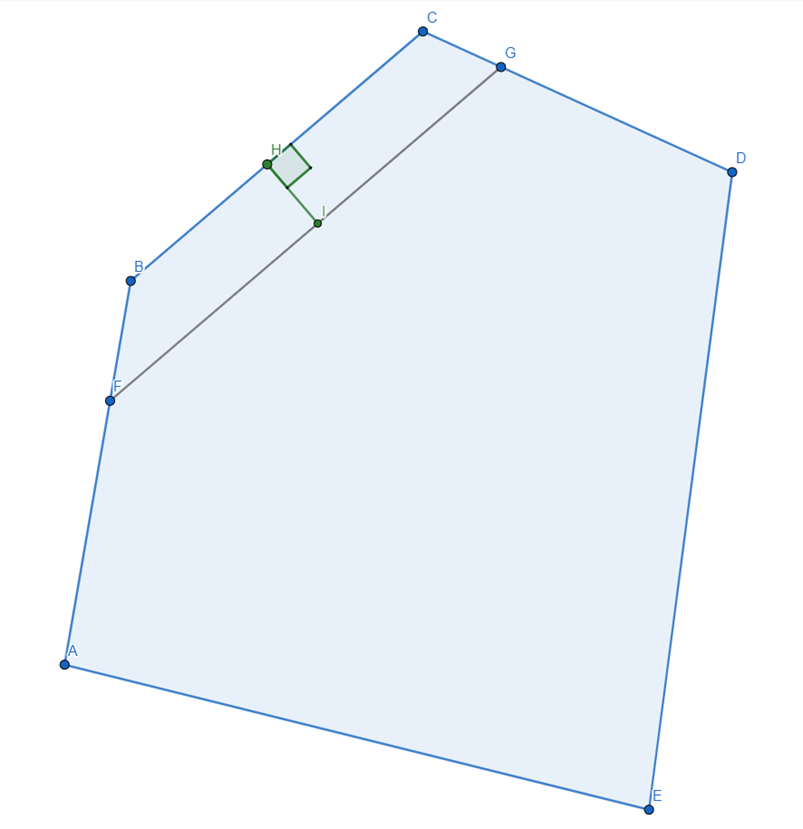

Description in English and Ukrainian
# Segment offset
A program for processing polygons. Allows you to create and display a polygon on the graph. By specifying the segment index,
direction (- / +) and distance (number), you can drag the segment to any point on the plot. The program will automatically
recalculates the polygon and displays a new one on the graph. The polygon can only be closed.
All possible exceptions in the Polygon recalculation are handled:
- Removal of unnecessary neighbouring segments. 
- Clumping the Polygon to 1 point.
- Removing the current segment as redundant when it goes beyond the intersection of neighbouring segments.

## Visualisation: 
Graph pyplot()
## Project launch:
Console --> from segment_offset import run_test_task
Terminal --> python segment_offset.py

# Segment offset
Програму для обробки полігонів. Дозволяє створити та відобразити полігон на графіку. Вказавши індекс сегменту,
напрямок (- / +) та відстань (число) можливо перетягти сегмент у будь-яку точку на площині. Програма автоматично
перерахує полігон та відобразить новий на графіку. Полігон має бути тільки замкнутий.
Оброблені всі можливі винятки в перерахунку Полігону:
- Видалення зайвих сусідніх сегментів. 
- Схлопування Полігону в 1 точку.
- Видалення поточного сегменту як зайвого коли він виходить за перетин сусідніх.

## Візуалізація: 
Графік pyplot()
## Запуск проекту:
Console --> from segment_offset import run_test_task
Terminal --> python segment_offset.py
